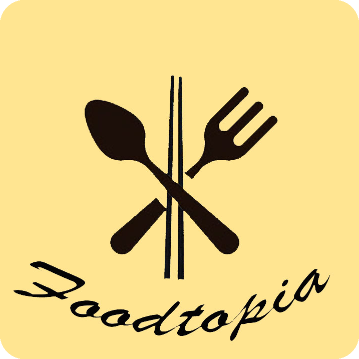
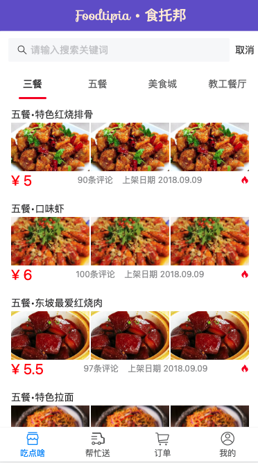

# Foodtopia(食托邦)

**产品 logo：**

**产品描述:** 

> Foodtopia项目致力于解决高校集中下课时间段食堂的排队拥挤问题。
>
> 在互联网和手机移动端普及的今天，我们尝试通过以下3种模式对传统高校食堂进行就餐流程的重新设计与组合：
>
> + 试图通过“线上点，线下取”的模式，引入一个点餐信息平台来解决排长队的问题；（模式一）
> + 利用排队理论的相关知识并结合物联网信息技术对传统高校食堂进行线下就餐流程的重新设计；（模式二）
> + 创新性地模仿滴滴、Uber的“共享私家车资源”模式，引入“校内共享配送劳动力”的概念，并以此推出“校内懒人餐”模块，以方便平时不愿意出门而常点外卖的同学也能享受到学校食堂的安心就餐服务。（模式三）
>
> 在解决排队拥挤问题的基础上，我们会增加一些趣味功能，如：食堂每日好菜推荐、食堂经典餐品推荐、食堂新品尝新推荐、健身减脂必点菜品推荐等）全方位为本校大学生提供合理健康高效的就餐选择。
>
> Foodtopia项目将提供“你说我说”（对菜品的问题或建议反馈）、“直面大厨”、“特色活动”等一系列连结食堂与学生的功能，增进学生对食堂的了解，以及提供相关消费维权的便利途径，争取打造一个更加透明的学校食堂。
>
> 通过Foodtopia项目，学校食堂能更加降低资源的浪费（例如减少剩菜剩饭、剔除冷门菜品、并且提高学校食堂座位资源的利用率等），由此相应减少经营成本以及增加学校食堂对学生的吸引力从而相应提高销售利润。
>
> 此外，平台可以和外部商家合作，适当引入广告和优惠活动来提高平台的收益。
> 用户群体：各大高校食堂（或事业单位食堂）

**项目愿景：**

> 相信Foodtopia项目在合理的规划运作下，能大大改善学校食堂的运作秩序与效率，并且大大提高本校大学生对食堂的认可度与满意度，提高学生的就餐质量与就餐体验。

**Beta版界面：**

**备注：**

+ 本仓库为最初版本设计，现将其用Vant重构
+ 基本技术：
  + Vue2：项目核心框架
  + vue-router：路由控制
  + Vant 组件库：界面元素组件
  + axios：Ajax 请求库
  + vue-cli：工程化生成项目
  + ESLint：统一代码风格规范
  + 其他基本技术：
    + JS ES6、HTML、CSS
    + less

